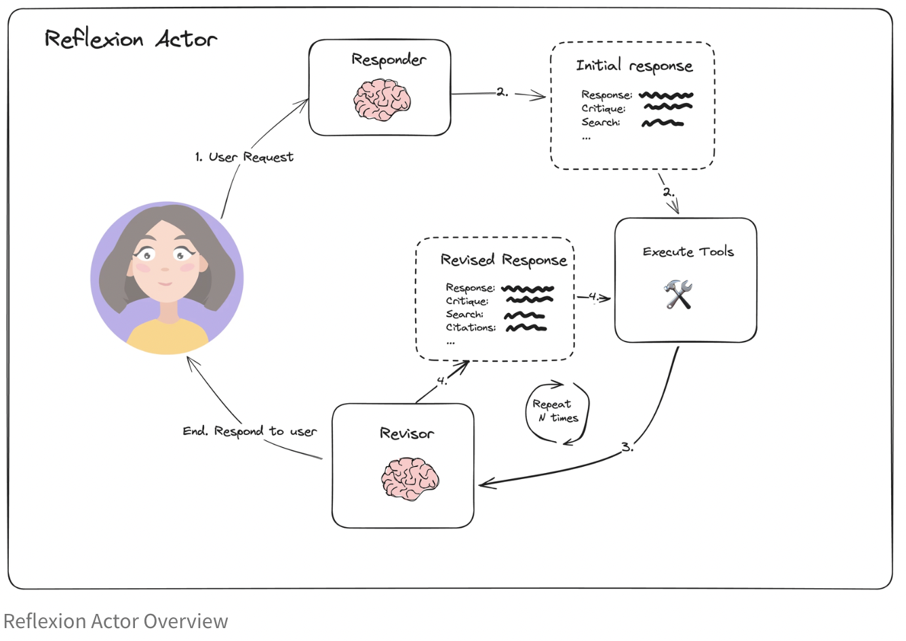
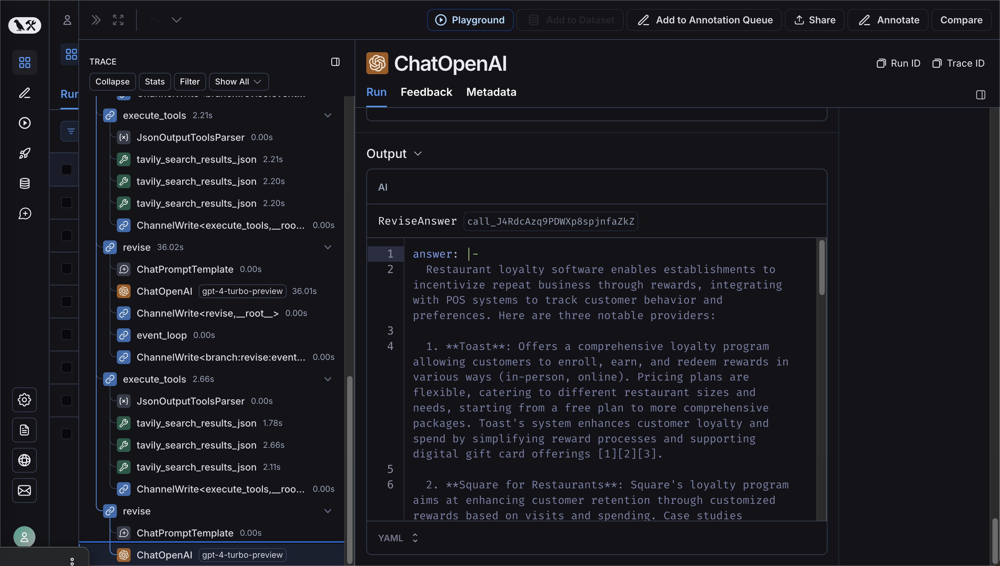

# 🤖️ Reflexion agent
## Description
🚀 Reflexion agents are a prompting strategy used to improve the quality and success rate of agents and similar AI systems.

Reference: https://arxiv.org/pdf/2303.11366

## Reflexion agent loop


## How to run the project
1. Clone the repository
2. Create a virtual environment using following commands.
    ```bash
    python3 -m venv .venv
    source .venv/bin/activate
    ```
   (Make sure you are using suitable python version, in my case python version 3.11.9)
3. Install the dependencies using following command.
    ```bash
    pip install -r requirements.txt
    ```
4. create a .env file in the root directory and populate it with the help of .env.example.
5. Run the project using following command.
    ```bash
    python3 main.py
    ```
6. Your result might take a few seconds. Output might not be in readable format in the terminal, but use langsmith to 
check the desired output.
